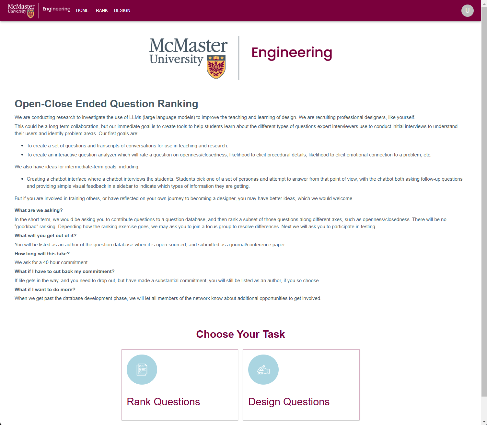
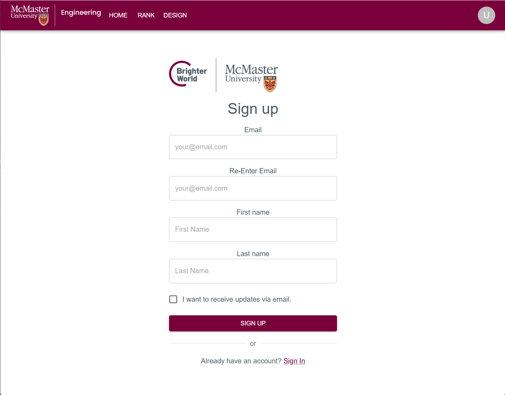
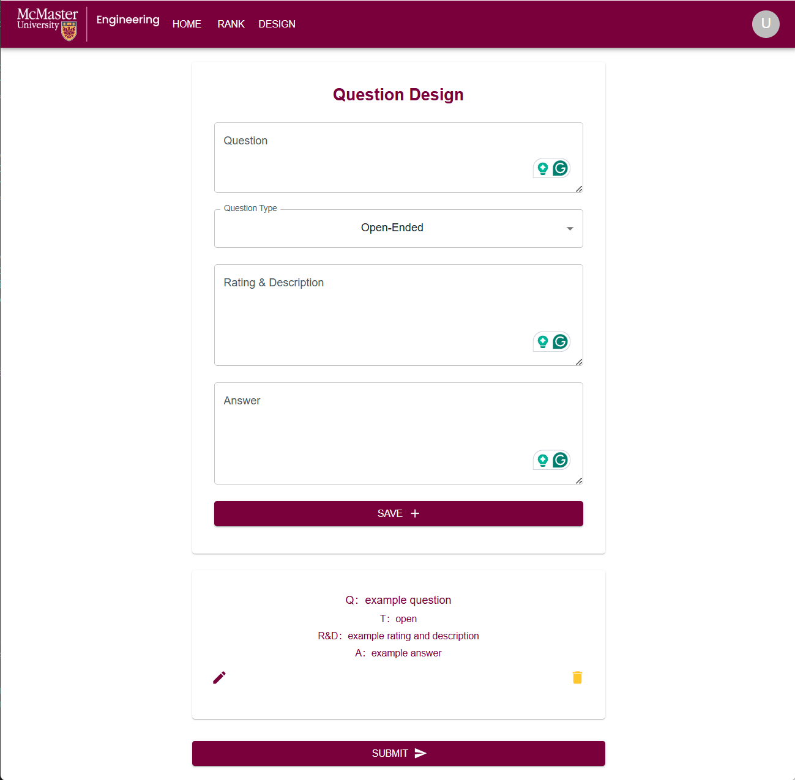
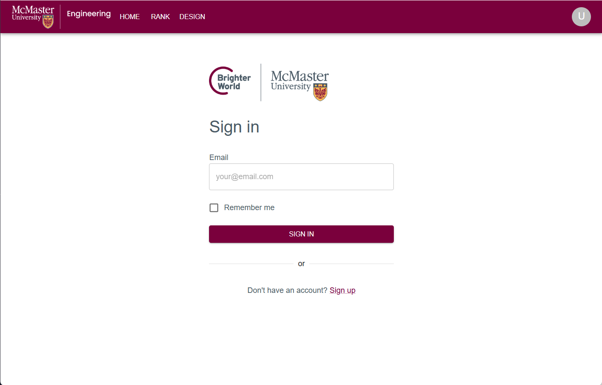
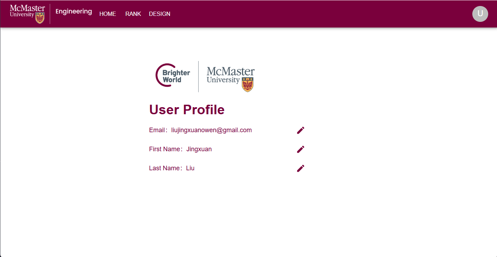

# Full Stack Flask and PostgreSQL

This fullstack web application is build for McMaster University CAS research group supervised by Dr. Christopher Anand. This questionaire based app is aim to collect Close and Open ending question data from the expert.

## Home Page

## SignUp Page

## Design Questions Page

## SignIn Page

## UserProfile Page
